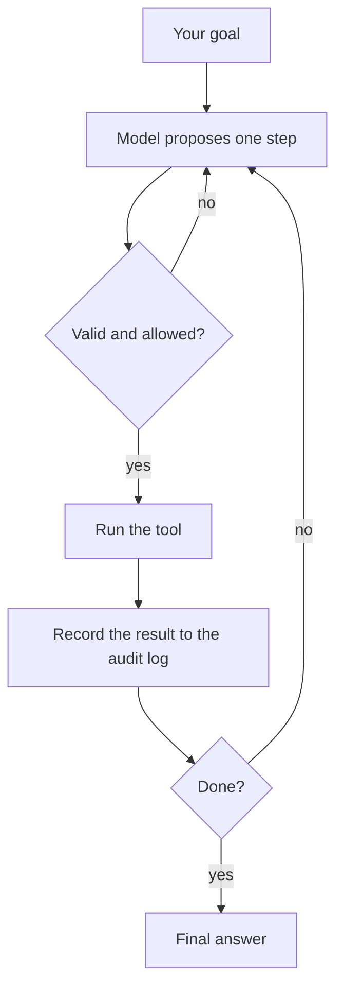

# Scoot

[English](README.md) | [中文](docs/README.zh.md)

<p align="center">
  
</p>

**Scoot is a small, safe AI agent that lives in your terminal.**

You give it a goal. It thinks in steps, runs local tools to make progress, and
writes down everything it did. No app to install, no cloud account, no state
leaving your machine — just one binary and a model backend you choose.

```sh
scoot -e "find every TODO in this repo and summarize them by file"
```

## What makes Scoot different

Most coding agents are large applications that trust the model and reach for the
cloud. Scoot is the opposite by design.

- **One tiny binary, no runtime.** Written in pure [Zig](https://ziglang.org), it
  ships as a single self-contained executable. Copy it to a laptop, a NAS, an
  edge device, or a container and it just runs. ([why Zig](book/en/src/design-philosophy.md))
- **Safe by default.** Scoot never executes raw model output. Every step is
  validated, and every tool call passes through a [policy gate](book/en/src/policy.md)
  that can block dangerous commands or refuse writes and network access entirely.
- **Fully auditable.** Every thought, tool call, observation, and decision is
  saved as plain JSONL. You can replay exactly what the agent did, after the fact.
- **Local-first.** Config, sessions, skills, and logs all live under `~/.scoot`.
  Nothing syncs anywhere you didn't ask it to.
- **Bring your own model.** Any OpenAI-compatible backend works — local
  (Ollama, vLLM) or hosted (OpenAI). No provider lock-in.
- **Extend without rebuilding.** Drop a folder with a `SKILL.md` into your skills
  directory and the agent can discover and use it. ([skills](book/en/src/skills.md))

## How it works

Scoot runs a [ReACT](book/en/src/agent.md) loop. Each turn, the model returns one
structured step, Scoot checks it, runs it, and feeds the result back:



The model can only ask for a fixed set of built-in actions — read and edit files,
search code, run bounded shell commands, make a single HTTP request, call a
skill, and a few more. It can never invent a capability that bypasses the gate.
See [Built-in Tools](book/en/src/tools.md) for the full list.

## Quick start

**1. Install.** One line installs the latest release for your platform:

```sh
curl -fsSL https://raw.githubusercontent.com/jamiesun/scoot/main/install.sh | sh
```

On macOS you can use Homebrew instead:

```sh
brew install jamiesun/tap/scoot
```

Prefer Docker, apt (scoot, scoot-wasm, and scoot-edge are all published
there), or compiling a smaller build from source? See [Installation](book/en/src/installation.md).

**2. Configure.** The wizard creates `~/.scoot` and writes your config:

```sh
scoot setup
```

It asks for your model backend and where to find the API token. Every config key
is documented in [Configuration](book/en/src/configuration.md).

**3. Run a goal.**

```sh
scoot -e "summarize this repository"   # one shot, prints the answer
scoot                                  # interactive REPL
```

Add `--trace` to watch the agent think and act in real time.

## Staying safe

Scoot has three policy modes. Pick the one that matches how much you trust the
task:

| Mode | Use it for | What it does |
| --- | --- | --- |
| `guarded` *(default)* | Everyday interactive work | Allows normal work, blocks catastrophic commands |
| `readonly` | Untrusted or unattended jobs | No writes, no shell, no network — reads only |
| `unrestricted` | Tasks you fully trust | No limits, still fully audited |

`guarded` is a convenience tripwire, not a sandbox. For unattended jobs Scoot
automatically drops to `readonly` — scheduled/daemon jobs coerce their `mode`, and
a one-shot `scoot --unattended -e "<goal>"` clamps in-child to the local
`edge.max_job_policy` ceiling (default `readonly`) so the command line can only
lower policy, never raise it. Pair it with OS-level isolation when you need strong
containment. Full threat model: [Execution Policy & Security](book/en/src/policy.md).

## Run it unattended

Scoot can also run on a schedule as a foreground daemon — handy for periodic
read-only checks, reports, or probes that a supervisor like `systemd` keeps
alive:

```sh
scoot daemon run
```

Scheduling, triggers (`every`, `at`, `cron`), and daemon lifecycle are covered in
[Scheduling & Daemon](book/en/src/scheduling.md).

## Documentation

The full, bilingual user guide is the mdBook under [`book/`](book/):

- [Installation](book/en/src/installation.md) — build, install, Docker, backends
- [Design Philosophy](book/en/src/design-philosophy.md) — goals, non-goals, boundaries
- [CLI Reference](book/en/src/cli.md) — every command and flag
- [Built-in Tools](book/en/src/tools.md) — the agent's action set
- [Execution Policy & Security](book/en/src/policy.md) — modes and threat model
- [Skills](book/en/src/skills.md) — authoring and using skills
- [Scheduling & Daemon](book/en/src/scheduling.md) — unattended jobs
- [Sessions & Audit](book/en/src/sessions.md) — local state formats
- [Embedding API](book/en/src/embed-api.md) — the stable Zig package surface

Chinese chapters live under [`book/zh/src/`](book/zh/src/). Project shape and
intent are in the [Roadmap](docs/ROADMAP.md) ([中文](docs/ROADMAP.zh.md)); contributor
guidance is in [AGENT.md](AGENT.md) ([中文](docs/AGENT.zh.md)).

## License

MIT. See [LICENSE](LICENSE).
