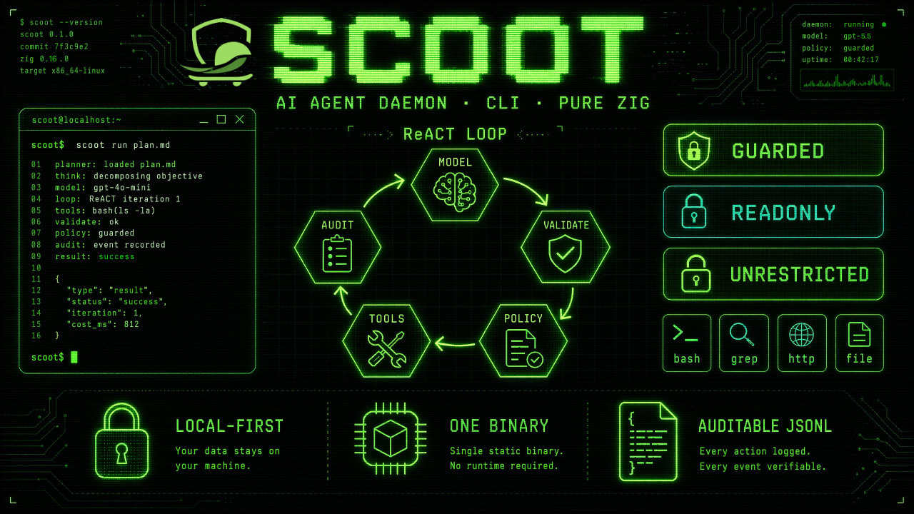

# Scoot

<p align="center">
  
</p>

<p align="center">
  
</p>

Scoot 是一个用纯 Zig 编写的轻量、本地优先的 AI agent **守护进程与 CLI**。它通过一个
防御式 **ReACT 循环** 驱动 OpenAI 兼容的模型后端，校验模型产出的每一个结构化步骤，
在 **执行策略门** 背后运行本地工具，并把每一步记录为可审计的本地状态。

它专为纯文本环境而构建——服务器、容器、CI runner、嵌入式 Linux——在这些场景下，你
想要一个可自动化、体积小、可预测、完全可检查的 agent，**没有 GUI、没有云同步、也没有
明文密钥**。

## 工作原理

每个回合都运行同一个防御式循环：

1. **询问** 模型，要求其给出恰好一个结构化步骤（`thought` + `action` + `action_input`）。
2. **校验** 该步骤是否符合严格的 JSON schema（绝不执行自由格式文本）。
3. **门控** 该动作，使其通过当前生效的执行策略（`guarded` / `readonly` / `unrestricted`）。
4. **运行** 选定的内建工具，在带硬超时的沙盒中执行。
5. **审计** 该动作，并写入会话对话记录与审计日志。
6. **观察**——把工具的输出作为下一个观察反馈给模型。

循环不断重复，直到模型给出 `final` 答复或触及 `max_turns`。

## 核心能力

- **两个入口**——一次性的 `scoot -e "<goal>"` 与交互式 REPL。
- **十个内建动作**——`bash`、`file_read`、`file_write`、`file_edit`、
  `grep`、`glob`、`http_request`、`skill`、`parallel` 与 `final`。这些
  结构化工具无需外部命令即可工作，因此在精简系统上行为完全一致。参见 [内建工具](tools.md)。
- **三种执行策略**——`guarded`（交互式绊线）、`readonly`
  （fail-closed（失败即关闭）），以及 `unrestricted`（有审计但不设限），外加可选的
  写入限制与 SSRF 加固。参见 [执行策略与安全](policy.md)。
- **本地技能** 配合渐进式披露——面向具体任务的指令包，从项目目录与用户目录中发现，
  通过原生只读的 `skill` 动作读取。参见 [技能](skills.md)。
- **调度与守护进程模式**——无人值守的任务始终以 fail-closed 的 `readonly` 安全级别运行，
  除非你主动选择放宽。参见 [调度与守护进程](scheduling.md)。
- **可审计状态**——会话与审计事件以仅追加（append-only）的 JSONL 持久化。参见 [会话与审计](sessions.md)。
- **灵活的配置与密钥**——TOML 优先，JSON 兜底，密钥从环境变量、`0600` 的 token 文件，
  或凭证命令加载——绝不内联写入。参见 [配置](configuration.md)。

## 快速开始

```sh
# 1. Build (Zig 0.16+).
zig build
zig build test

# 2. Point Scoot at a backend (defaults to a local Ollama-compatible endpoint).
export OPENAI_API_KEY="sk-..."          # only if your backend needs a key

# 3. Inspect the resolved runtime and health.
./zig-out/bin/scoot config
./zig-out/bin/scoot doctor

# 4. Run a one-shot goal, or start the REPL.
./zig-out/bin/scoot -e "count the Zig source files in this repository"
./zig-out/bin/scoot            # interactive REPL; /exit to leave
```

初次接触 Scoot？请按顺序阅读 [安装](installation.md) → [配置](configuration.md)
→ [CLI 参考](cli.md)。想了解 agent 究竟能 *做* 什么？参见
[内建工具](tools.md) 与 [执行策略与安全](policy.md)。

## 运行目录

Scoot 默认把所有内容放在 `~/.scoot` 下。可用 `--scoot-home` 标志或
`SCOOT_HOME` 环境变量覆盖（标志优先）。

```text
~/.scoot/
  config.toml      # configuration (config.json is the fallback)
  token            # optional 0600 API token file
  skills/          # user-level skills
  logs/            # audit / run logs (audit.jsonl)
  state/           # sessions, daemon lifecycle, scheduler state
```

从 [`config.example.toml`](https://github.com/jamiesun/scoot/blob/main/config.example.toml) 开始——把它复制到
`~/.scoot/config.toml` 再编辑。

## 设计原则

Scoot 刻意保持保守。以下是不可妥协的边界，而非偏好：

- 本地优先的运行时状态，一个小巧的二进制，没有 GUI；
- 仅支持 OpenAI 兼容后端——不蔓延到各家厂商专有协议；
- 提交的配置、日志或审计输出中没有明文密钥；
- 绝不执行未经校验的模型输出；
- 技能只增加指令与数据，绝不增加特权执行路径。

完整的演进规则集请参见 [路线图](roadmap.md) 与 [Agent 指南](agent.md)，
它们规定了 Scoot 如何演进。
