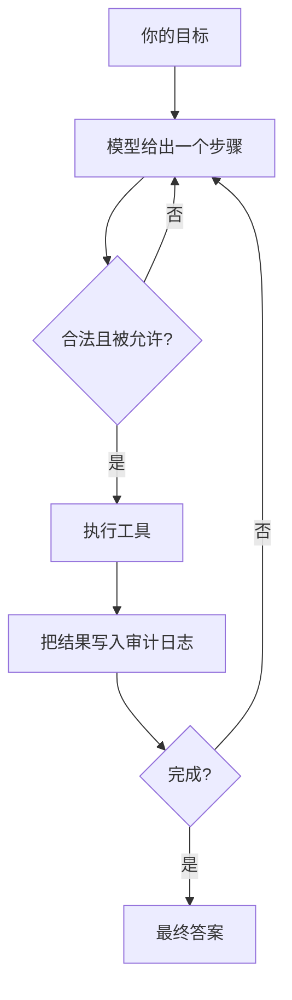

# Scoot

[English](../README.md) | 中文

<p align="center">
  
</p>

**Scoot 是一个住在终端里的小而安全的 AI Agent。**

你给它一个目标，它分步思考、调用本地工具推进任务，并把做过的每一步都记录下来。
不需要安装应用、不需要云账号、状态不离开你的机器——只有一个二进制和你自己选择的
模型后端。

```sh
scoot -e "找出本仓库里所有 TODO，并按文件汇总"
```

## Scoot 有什么不一样

大多数编码 Agent 都是庞大的应用，倾向于信任模型、依赖云端。Scoot 在设计上正好相反。

- **一个极小二进制，无运行时。** 用纯 [Zig](https://ziglang.org) 编写，发布为单个
  自包含可执行文件。拷到笔记本、NAS、边缘设备或容器里就能跑。
  （[为什么用 Zig](../book/zh/src/design-philosophy.md)）
- **默认安全。** Scoot 从不直接执行模型原始输出。每一步都会被校验，每次工具调用都要
  经过[策略门](../book/zh/src/policy.md)——它可以拦截危险命令，或彻底拒绝写入和网络访问。
- **完全可审计。** 每条思考、工具调用、观察结果和决策都以纯 JSONL 落盘。事后可以
  精确复盘 Agent 到底做了什么。
- **本地优先。** 配置、会话、技能和日志都位于 `~/.scoot`，不会同步到任何你没要求的地方。
- **自带模型。** 任意 OpenAI 兼容后端均可——本地（Ollama、vLLM）或云端（OpenAI），
  没有厂商锁定。
- **无需重编译即可扩展。** 把一个带 `SKILL.md` 的目录放进技能目录，Agent 就能发现并
  使用它。（[skills](../book/zh/src/skills.md)）

## 工作原理

Scoot 运行一个 [ReACT](../book/zh/src/agent.md) 循环。每一轮，模型返回一个结构化步骤，
Scoot 校验、执行，再把结果回灌：



模型只能请求一组固定的内建动作——读写文件、搜索代码、执行受控 shell 命令、发起单次
HTTP 请求、调用技能等。它无法凭空造出绕过策略门的能力。完整列表见
[内建工具](../book/zh/src/tools.md)。

## 快速开始

**1. 安装。** 一行命令安装适合你平台的 latest release：

```sh
curl -fsSL https://raw.githubusercontent.com/jamiesun/scoot/main/install.sh | sh
```

macOS 也可以用 Homebrew：

```sh
brew install jamiesun/tap/scoot
```

想用 Docker、可选的 Wasm host，或从源码编译更小的构建？见
[安装](../book/zh/src/installation.md)。

**2. 配置。** 向导会创建 `~/.scoot` 并写好配置：

```sh
scoot setup
```

它会询问你的模型后端和 API token 来源。所有配置项见
[配置](../book/zh/src/configuration.md)。

**3. 运行一个目标。**

```sh
scoot -e "总结这个仓库"   # 单次执行，直接打印答案
scoot                    # 交互式 REPL
```

加上 `--trace` 可以实时看到 Agent 的思考与动作。

## 保持安全

Scoot 有三种策略模式。按你对任务的信任程度选择：

| 模式 | 适用场景 | 行为 |
| --- | --- | --- |
| `guarded`（默认） | 日常交互工作 | 允许正常工作，拦截灾难性命令 |
| `readonly` | 不可信或无人值守任务 | 不写入、不 shell、不联网——只读 |
| `unrestricted` | 你完全信任的任务 | 无限制，但仍全程审计 |

`guarded` 是一道便利的绊线，不是沙箱。无人值守任务会被自动降级为 `readonly`；当你需要
强隔离时，应再叠加 OS 级隔离。完整威胁模型见
[执行策略与安全](../book/zh/src/policy.md)。

## 无人值守运行

Scoot 也能作为前台 daemon 按计划运行——适合周期性的只读检查、报告或探针，由 `systemd`
这类 supervisor 负责保活：

```sh
scoot daemon run
```

调度、触发器（`every`、`at`、`cron`）和 daemon 生命周期见
[调度与守护进程](../book/zh/src/scheduling.md)。

## 文档

完整的双语用户手册是 [`book/`](../book/) 下的 mdBook：

- [安装](../book/zh/src/installation.md) — 构建、安装、Docker、后端
- [设计理念](../book/zh/src/design-philosophy.md) — 目标、非目标、边界
- [CLI 参考](../book/zh/src/cli.md) — 每个命令和参数
- [内建工具](../book/zh/src/tools.md) — Agent 的动作集
- [执行策略与安全](../book/zh/src/policy.md) — 模式与威胁模型
- [Skills](../book/zh/src/skills.md) — 编写和使用技能
- [调度与守护进程](../book/zh/src/scheduling.md) — 无人值守任务
- [会话与审计](../book/zh/src/sessions.md) — 本地状态格式
- [嵌入 API](../book/zh/src/embed-api.md) — 稳定的 Zig 包表面

英文章节见 [`book/en/src/`](../book/en/src/)。项目形态与意图见
[路线图](ROADMAP.zh.md)（[English](ROADMAP.md)）；贡献指南见
[AGENT.zh.md](AGENT.zh.md)（[English](../AGENT.md)）。

## 许可证

MIT，见 [LICENSE](../LICENSE)。
